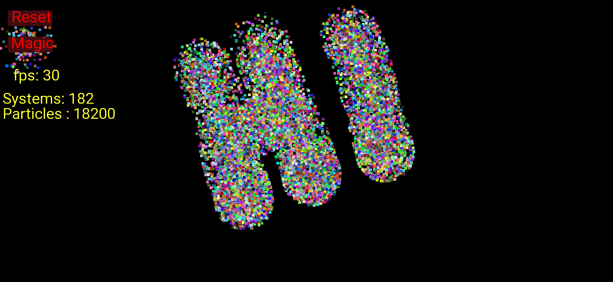
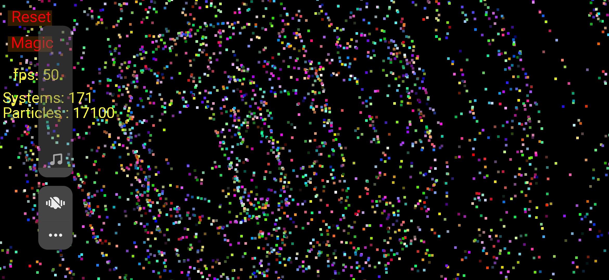
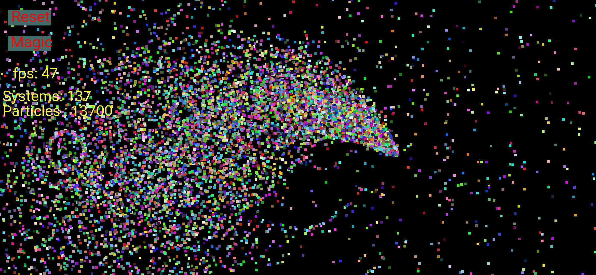

# LiveDrawing
An application to transform touches into realtime images on screen

## Screenshots

## What it includes?
- The application is a simple game where user interacts with the screen and creates objects which transforms and moves on the whole screen creating a very delightful appearance.
- The application also shows current FPS and can also be used to change the size and appearance of the objects created.

#### Features
- Shows current FPS
- Can be used to create 1000 instances
- Each instance burst into 100 more instances 
- Can change color and size of each instance 
